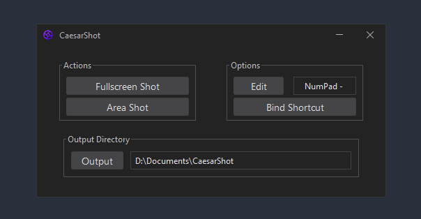
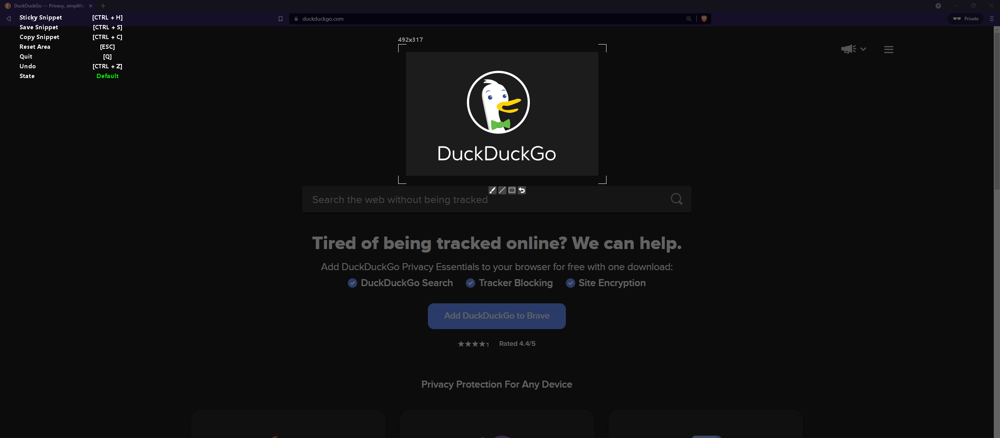
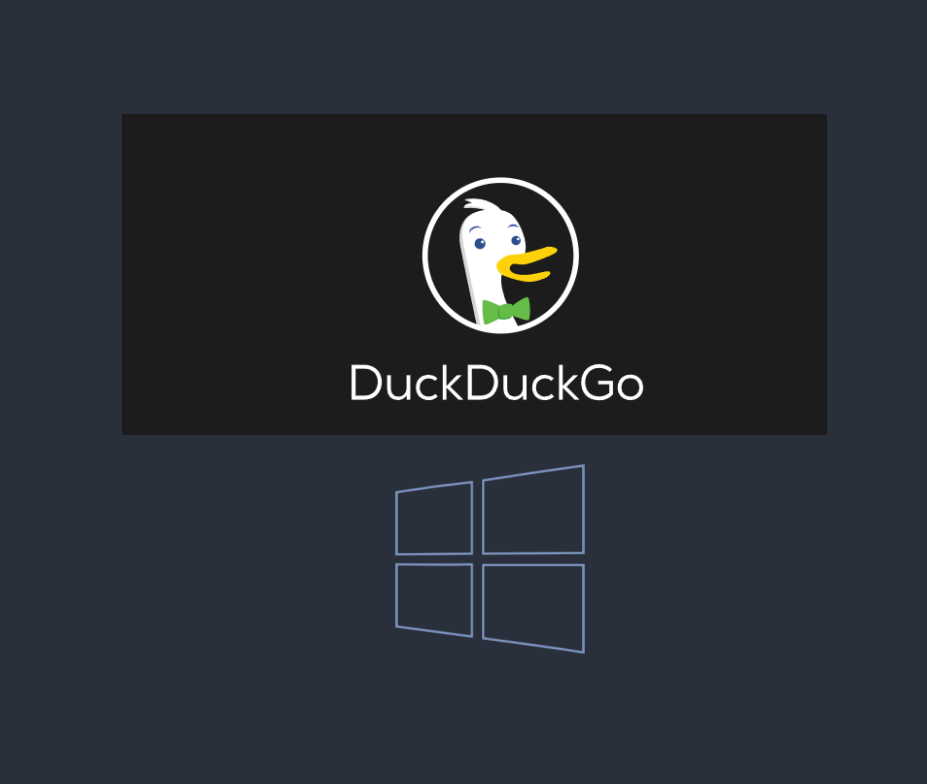
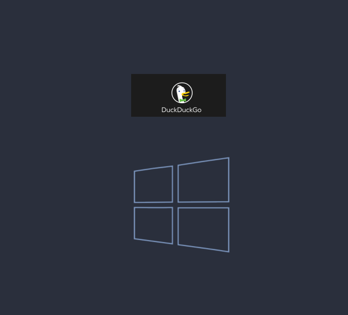
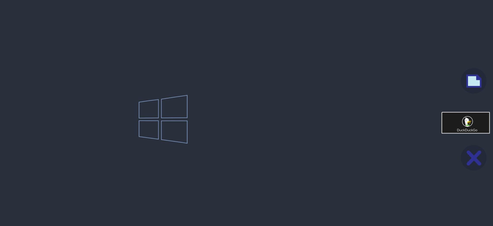

# CaesarShot
#### A utility that captures full and regional screenshot.
#### The snippet can set on top of the screen until the user decides to copy or delete it.
+ Capture region screenshot
+ Capture full screenshot
+ Add the snippet on top of the screen
+ Copy or delete actions on the snippet
+ Toolbar for drawing and painting
+ Shortcut for quick snippet shot

JRE 9 is bundled with the installer

---

# Used Libraries

+ [FlatLaf](https://github.com/JFormDesigner/FlatLaf/) by JFormDesigner
+ [JNativeHook](https://github.com/kwhat/jnativehook/) by kwhat
